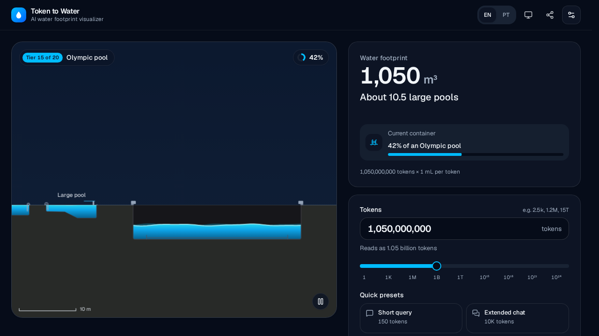

<p align="center">
  
</p>

<h1 align="center">Token to Water</h1>

<p align="center">
  <b>How much water do AI tokens cost?</b> From a single drop to all the water on Earth.
</p>

<p align="center">
  <a href="https://kelvin-jesus.github.io/token-to-water/"><b>Open the live app →</b></a>
  &nbsp;·&nbsp;
  <a href="https://github.com/Kelvin-Jesus/token-to-water/actions/workflows/ci.yml"></a>
</p>

<p align="center">
  
</p>

An AI water footprint visualizer. Type a number of tokens and watch the water they cost fill a container. When it overflows, the camera zooms out to the next one, and keeps going from a single drop, through buckets, water trucks and Olympic pools, up to all the water on Earth.

- **20-tier "Powers of Ten" ladder** drawn to scale by volume, with a map-style scale bar (mm → km).
- **Human equivalencies**: "Equivalent to 1 bucket and 1 large bottle", "About 10.5 large pools", "42% of an Olympic pool".
- **Controls**: formatted input with shorthand (`2.5k`, `1.2M`, `15T`, `1e24`), a logarithmic slider from 1 to 10²⁵ tokens, quick presets, and a tier ladder that jumps to any container.
- **Comfortable for most people**: English and Brazilian Portuguese, light/dark/system theme, reduced motion, a pause button, keyboard and screen-reader support (WCAG 2.2 AA), 44 px touch targets, and shareable URLs (`?t=1500&f=0.3`).
- **Fast on budget phones**: a Canvas 2D renderer (no 3D engine), adaptive quality with automatic battery-saver fallback under 45 FPS, 30 FPS when idle, a full pause when off screen, and a ~160 KB gzip critical path.

## Quick start

```bash
npm install
npm run dev        # http://localhost:5173
npm run build      # production build in dist/
npm run preview    # serve dist/ on http://localhost:4173
```

Requires Node 22+. Browser tests use Playwright's Chromium (`npx playwright install chromium` if it isn't cached yet).

## Deployment

Every push to `main` runs CI (`.github/workflows/ci.yml`). The `deploy` job publishes `dist/` to GitHub Pages only after the static checks, unit tests and browser tests pass. The build uses a relative base (`base: './'` in `vite.config.ts`), so the same output works at a domain root, under `/token-to-water/`, or in any folder. The `pages` Playwright project proves this: `scripts/serve-subpath.mjs` serves `dist/` only under `/token-to-water/`, as Pages does, and any root-relative asset URL would 404.

## The conversion

`src/constants/scales.ts`:

```ts
export const LITERS_PER_TOKEN = 0.001 // 1 mL per token → a 500-token prompt ≈ a 500 mL bottle
export const WATER_FACTOR = { min: 0.1, max: 10, default: 1 } // "Water per token" setting
```

This is a round reference rather than a measurement. Published estimates vary by orders of magnitude with the model, hardware, data centre, climate and season. The in-app "How the numbers work" section says so, and Settings lets people scale the rate.

> **Data note:** the brief listed the Mediterranean and Atlantic at 1,000× too small (their m³ volumes labelled as litres). This app uses the published figures in litres. See [ADR 0001](docs/adr/0001-ocean-volumes-in-litres.md).

## Architecture

```
src/
├── types/index.ts            Domain types (Tier, TierPosition, Equivalence, …)
├── constants/scales.ts       The 20 tiers, conversion constants, presets
├── lib/                      Pure, framework-free logic
│   ├── conversion.ts         tokens → litres → active tier + fill
│   ├── equivalence.ts        "3 buckets and 1 bottle" (greedy, max two terms)
│   ├── logScale.ts           logarithmic slider mapping
│   ├── parseTokens.ts        locale-aware parsing, shorthand, live digit grouping
│   ├── ladder.ts             litres ⇄ ladder position: equal screen time per tier
│   ├── camera.ts             fixed-point zoom (the Powers-of-Ten camera move)
│   ├── motion.ts             frame-rate-independent spring and damping
│   ├── fpsMonitor.ts         sustained-low-FPS detection
│   ├── device.ts             initial quality from device hints
│   ├── urlState.ts, preferences.ts
├── render/                   Canvas scene, independent of React
│   ├── shapes.ts             20 silhouettes; area-accurate fill levels
│   ├── layout.ts             world layout: box area = (∛V)², honest by volume
│   ├── scene.ts              animation state + drawing (waves, particles, labels, scale bar)
│   ├── palette.ts, particles.ts
├── hooks/usePerformanceTier.ts   FPS monitor + low-power detection (+ other hooks)
├── utils/formatters.ts       mL / L / m³ / km³, mass, length, durations, big-number words
├── i18n/                     en + pt-BR messages, tier nouns, equivalence phrasing
└── components/
    ├── WaterVisualizer.tsx   canvas + rAF loop + HUD (zero React re-renders per frame)
    ├── TokenInput.tsx        formatted input + log slider
    ├── PresetButtons, EquivalenceReadout, StatsGrid, TierLadder, SettingsDialog, Header, …
    └── ui/                   shadcn/ui-style primitives on Radix (Slider, Dialog, ToggleGroup, Switch)
```

Key decisions:

- **The animation loop runs outside React.** `WaterScene.frame(dt)` is called from `requestAnimationFrame`. The HUD is updated by direct DOM writes, and only when its text changes. Props reach the scene through effects that wake the loop, and the loop stops itself once nothing moves.
- **The camera zooms around a fixed point.** Scale and translation are not interpolated separately. Every transition is a pure zoom around the one world point both framings share, which is what makes it look like *Powers of Ten* rather than a pan.
- **The water level animates along the tier ladder** (`lib/ladder.ts`), where every container is exactly one unit wide, using a critically damped spring capped at 1.3 tiers/s. Each container gets the same ~0.8 s on screen, whether it is 1.3× (bucket → jug) or 180,000× (lake → Amazon) bigger than the last. The opening intro takes ~5 s; a full drop-to-Earth journey ~17 s.
- **Battery saver** (automatic below 45 FPS, or chosen in Settings) removes secondary wave harmonics, splash particles, bubbles, stars, glow and CSS backdrop blur, and caps DPR at 1.5.
- **Settings is lazy-loaded** and preloaded on hover or focus of its button. Radix Tooltip was replaced by a CSS-only tooltip (it cost about 15 KB gzip).

## Tests

| Layer | Tool | Command | What it covers |
| --- | --- | --- | --- |
| Static | TypeScript strict, ESLint (type-checked + jsx-a11y strict) | `npm run lint`, `npm run typecheck` | |
| Unit | Vitest (Node) | `npm test` | conversion, equivalence, parsing, formatters, camera, motion, FPS monitor, shapes, layout, scene (recording canvas stub) |
| Property-based | fast-check | (in `npm test`) | invariants: monotonic tiers and slider, parse ⇄ format round-trips, fill-by-area accuracy, camera convergence, "never NaN on the canvas" |
| Component, hook, integration | Testing Library + jsdom | (in `npm test`) | input, slider keyboard, presets, ladder, dialog, HUD, URL sync, i18n, live-region announcements |
| Accessibility (structure) | axe-core in jsdom | (in `npm test`) | WCAG 2.2 A/AA rules across the app, dialog and error states |
| Type | Vitest `expectTypeOf` | `npm run test:types` | translation key parity, tier id union, discriminated unions |
| Benchmarks | Vitest 5 `bench` fixture | `npm run test:bench` | per-frame JS budget for every tier and during a full sweep |
| End-to-end | Playwright (Chromium desktop, Pixel 7, Firefox) | `npm run test:e2e` | real user journeys on the production build, canvas pixel checks, persistence, sharing, no-flash theme |
| Layout stability | Playwright (all three) | (in `test:e2e`) | drags the slider through 100 stops in EN and PT-BR: the slider and readout must not move by a pixel, and nothing may overflow sideways |
| Deployment | Playwright + sub-path static server | (in `test:e2e`) | the build under `/token-to-water/`: assets, lazy chunk, favicon, manifest, shareable URLs |
| Accessibility (real browser) | @axe-core/playwright | (in `test:e2e`) | colour contrast in both themes, keyboard-only use, focus rings, 320 px reflow, 200 % text, touch-target sizes |
| Visual regression | Playwright screenshots, frozen clock | `npm run test:visual` | deterministic canvas and layout snapshots |
| Performance | Playwright + CDP | `npm run test:perf` | 60 FPS sweep, 4× CPU throttle, automatic battery-saver fallback, pause off screen, idle half rate, LCP and CLS, memory leaks, bundle-size budget |
| Mutation | Stryker | `npm run test:mutation` | how well the unit tests catch injected bugs in `lib/`, `utils/` and `i18n/format.ts` (≈ 86 %; the build fails below 70 %) |

`npm run test:all` runs everything except mutation testing. The perf suite reports its measurements (`[metric] sweep fps: 60.15 FPS`, and so on) next to the pass/fail result.

Notes:

- Visual baselines are platform-specific (`*-linux.png`) and compared at a 0.1 % pixel tolerance, since rendering under the frozen clock is deterministic. Regenerate them with `npm run test:visual:update` on a new OS or CI image. CI skips this suite until baselines exist for its runner.
- Starting quality: only devices reporting ≤ 2 CPU cores, ≤ 2 GB memory or data saver start in battery saver. A 4-core CI runner holds 60 FPS under 4× CPU throttling, and Safari under-reports cores. Everything else is left to the runtime FPS monitor.
- Stryker uses its generic *command* runner, because `@stryker-mutator/vitest-runner` does not activate mutants under Vitest 5.
- `?debug` exposes frame counters on `window.__TTW_PERF__`. `?debug&stress=30` burns 30 ms per frame to simulate a slow phone.
